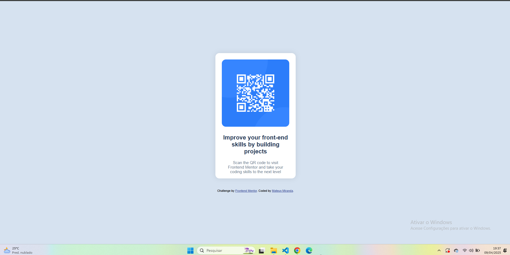

# Frontend Mentor - QR Code Component

This is a solution to the [QR code component challenge on Frontend Mentor](https://www.frontendmentor.io/challenges/qr-code-component-iux_sIO_H). Frontend Mentor helps you improve your coding skills by building real projects.

### 📸 Screenshot



### 🧑‍💻 Built With

- HTML5
- CSS3
- Flexbox
- Responsive Design (375px and 1440px)

### 💡 What I Learned

- Semantic HTML structure
- Flexbox layout techniques
- Responsive design using media queries

### 📦 How to Use

Clone the repository and open the `index.html` file in your browser:

```bash
git clone https://github.com/mateussmiranda/qr-code-component.git
cd qr-code-component


Made with ❤️ by Mateus.
